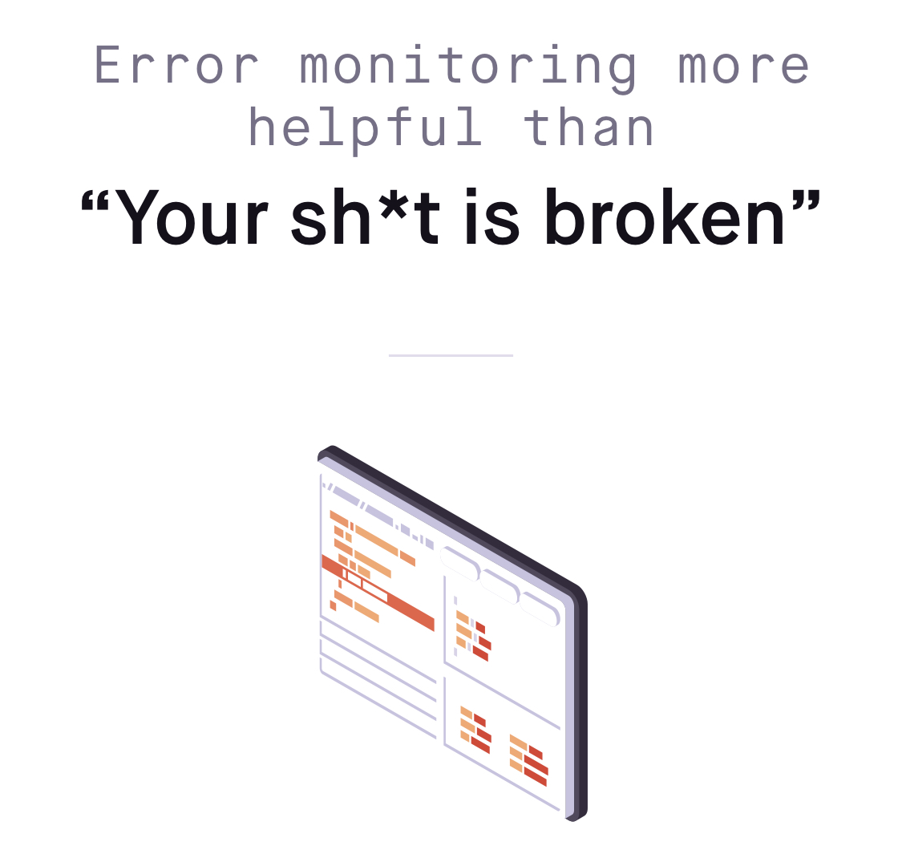
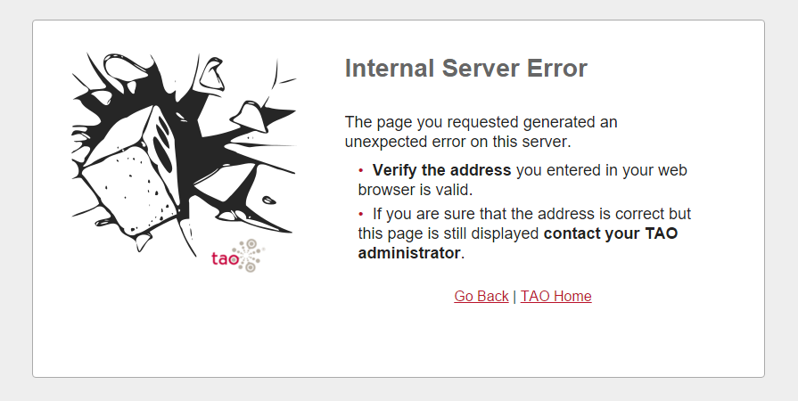
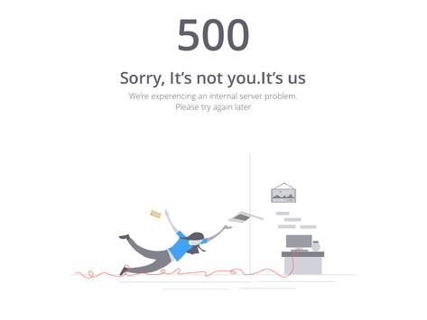
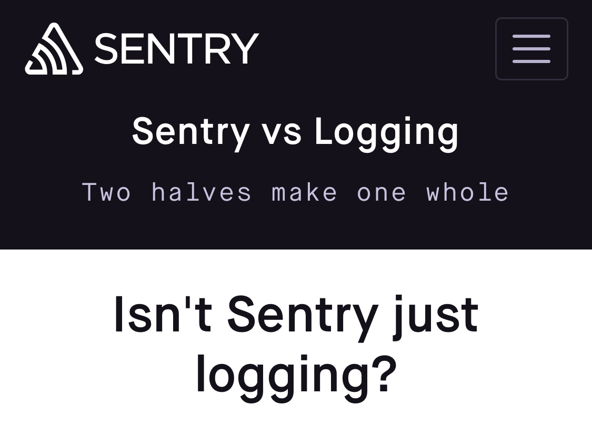

build-lists: true

# [fit] Sentry
## What is it, how do you use it, and why should you care?

---

# Sentry is an _exception tracker_

### whats that?

---

# The pitch: _Sentry allows find and fix bugs in production before our users report them._

### or as Sentry helpfully puts it...

---



---

# Sentry gives us tools for tracking and resolving _uncaught exceptions_

### you know, these:

---


---




---



---

# Isn't that what the logs are for?

---



---

>  Logging provides you with a trail of events. Often those events are errors, but many times they're simply informational. Sentry is fundamentally different because we focus on exceptions and application crashes. Sentry does not replace the need for those logs, and _it's also not a destination for things that aren't actionable errors or crashes_.

-Sentry docs

---

# Logs inform us about _expected_ events

---

## Sentry informs us about _unexpected_ events

---

# Logs inform us about _expected_ events

```php
Logger::debug("Searching for user")

$user = User::findBy($id);

if ($user == null) {
  Logger::warning("User not found!");
}
```

---

# Logs inform us about _expected_ events

```php
Logger::info("Searching for user");

try {
  $user = User::findBy($id);
} catch (NotFoundException $e) {
  Logger::error("User not found!", ["exception" => $e]);
}
```

---

# But what about _unexpected_ events?

```php
try {
  $user = User::findBy($id);
  // throws ArgumentException: 
  // expected $id to be of type integer, got string

} catch (NotFoundException $e) {
  Logger::error("User not found!", ["exception" => $e]);
}
```

_Where are your logs now?_

---

# Easy peasy!

```php
try {

  try {
    $user = User::findBy($id);
  } catch (NotFoundException $e) {
    Logger::error("User not found!", ["exception" => $e]);
  }

} catch (Exception $e) {
  Logger::error("Unexpected error!!", ["exception" => $e]);
}
```
_How long will it be until you know about the error?_

---

# Not all bugs are exceptions, _but most uncaught exceptions are bugs_

---

# Uncaught exceptions are _really, really bad_.

- Users seeing 500 pages
- Data not loading
- Background processes failing to do their work
- It's basically your program giving up :(

---

# Sentry helps us answer important questions about bugs caused by exceptions:

- When was it introduced?
- How many users have experienced it?
- What was the user doing when they experienced it?

---

# Sentry notifies us about exceptions, and creates a workflow for resolving them:

- Actively notify after certain number of occurences/number of users are affected.
- Ignore potentially unactionable exceptions until they become larger issues.
- Resolve exceptions, track regressions, and view new issues in a release.

---

# Sentry Main Concepts

---

# Projects

*Project*: Sentry's idea of an application.  Hosted, DeepData, iOS CRM, ember-app.

_Projects_ are identifered by a DSN:

```
https://4720d02296f74f2492978ba6bdd09929@sentry.io/133474
```

---

# Issues

*Issue*: A class of exceptions within a _project_, specific to a single location in the code.

---


# Events

*Event*: A single instance of an _issue_. Sentry will intelligently group _events_ into _issues_.

---

# Context

*Context*: Extra data associated with an _event_ (request parameters, browser, logged in user).

---

# Integrating Sentry into an application

_demo_

---

# Install

```
# Pipfile/requirements.txt

[packages]
flask = "*"
flask_sqlalchemy = "*"
sentry-sdk = "*"
"sentry-sdk[flask]" = "*"
```

---

# Import the SDK


```python
# app.py

import sentry_sdk
sentry_sdk.init(
  "https://40c3c5d83e5a46199f063c0ac2b5d200@sentry.io/1390866"
)
```

---

# Catch exceptions in web requests


```python
@app.errorhandler(Exception)
def handle_exception(e):
    sentry_sdk.capture_exception(e)
    raise e
```

---

# Shortcut with the Flask SDK


```python
from sentry_sdk.integrations.flask import FlaskIntegration

sentry_sdk.init(
    dsn="https://40c3c5d83e5a46199f063c0ac2b5d200@sentry.io/1390866",
    integrations=[FlaskIntegration()],
)
```

---

# Adding user context

```python
@app.before_request
def setup_setry_context():
    with sentry_sdk.configure_scope() as scope:
        if 'user' in session:
            scope.user = {"id" : session['user']}
```
---

# Environment

```python
sentry_sdk.init(
    dsn="https://40c3c5d83e5a46199f063c0ac2b5d200@sentry.io/1390866",
    environment=app.config["ENV"],
    integrations=[FlaskIntegration()],
)
```
---

# Callbacks

```python
def before_sentry_send(event, hint):
    if app.config["ENV"] == "development":
        return None

    Metrics.increment("exceptions.count")
    return event
```
---

# Callbacks

```python
sentry_sdk.init(
    dsn="https://40c3c5d83e5a46199f063c0ac2b5d200@sentry.io/1390866",
    environment=app.config["ENV"],
    integrations=[FlaskIntegration()],
    before_send=before_sentry_send
)
```
---

# Ignore Exceptions

```python
import werkzeug.exceptions

sentry_sdk.init(
    dsn="https://40c3c5d83e5a46199f063c0ac2b5d200@sentry.io/1390866",
    environment=app.config["ENV"],
    integrations=[FlaskIntegration()],
    before_send=before_sentry_send
    ignore_errors=[werkzeug.exceptions.NotFound],
)
```

---

# Capturing Exceptions outside of HTTP requests

```python
# cron job that runs daily

for todo in todos:
    try:
      if todo.text == "Can't delete me!":
          raise PermissionError("Couldn't delete todo!")

      todo.delete()
    except Exception as e:
      Logger.info("Encountered error!")
```

---

# Capture those errors!

```python
for todo in todos:
  try:
      if todo.text == "Can't delete me!":
          raise Exception("Couldn't delete todo!")

      todo.delete()

  except Exception as e:
      # Capture the exception, but keep the job moving
      print("Encountered exception")
      capture_exception(e)
```

---

# Custom Tags

```python
# clear_todos.py

with sentry_sdk.configure_scope() as scope:
    scope.set_tag("cron-job", "clear_todos")

for todo in todos:
  ...
```

Searchable in Sentry as `cron-job-name:clear_todos`. Indexed!

---

# Custom Context


```python
with sentry_sdk.configure_scope() as scope:
    scope.set_tag("cron-job", "clear_todos")
    scope.set_extra("todo.id", todo.id)
    scope.set_extra("todo.text", todo.text)
```

---

# [fit] Sentry and *you*

## How can you incorporate Sentry into your team's workflow?

---

# Exception tracking should be set up for every new app _before it's first production deploy._

---

# Step 1: Create a project for your team's applications

### Maybe ask an admin for help.

---

# Step 2: Integrate the SDK, make sure it's capturing everywhere

### Test it in prod and staging, disable it in development.

---

# Step 3: Ignore Unactionable Exceptions

### Otherwise they'll eat into our rate limits.

---

# Step 4: Add user and extra context

### At minimum, set `user.id` to the Hosted account.

---

# Step 5: Set up notification rules

### They're super customizable.

---

# Example Notification Rulset

- New issues go to Slack.
- 100 events for an issue in a day sends an email.
- 1000 events/100 users in an hour Pages someone.

---

# Step 7: Utilize Sentry's workflow

### Interruptible dev should look at new issues immediately.

---

# Workflow for new issues:

_after triaging the issue, do one of the following_

1. Immediately release a fix, move to _Resolved_.
2. Move to _Ignored_ - circle back when impact is more clear.
3. Create a backlog item, leave a comment in Sentry.
4. Don't do nothing.

---

# Workflow for an issue backlog:

- Prioritize by impact to users.
- Fix issues as they come up in client bugs (utilize search).
- Filter out what's not actionable.
- Utilize auto-resolve.
- Follow the same workflow for new issues!

---

# There's a lot more to learn!

- Releases and Github integration
- Breadcrumbs
- Client-side integrations! (team mobile, where you at)

---

# Resources

Sentry best practices on Confluence:
  - https://activecampaign.atlassian.net/wiki/spaces/DEV/pages/444498665/Sentry+for+Developers+-+Overview+and+Best+Practices
Clone the sample application (slides are also here).
  - https://github.com/akowalz/sentry-example-app/
Sentry Documentation:
  - https://docs.sentry.io/

---

# [fit] Thank you! Questions?
