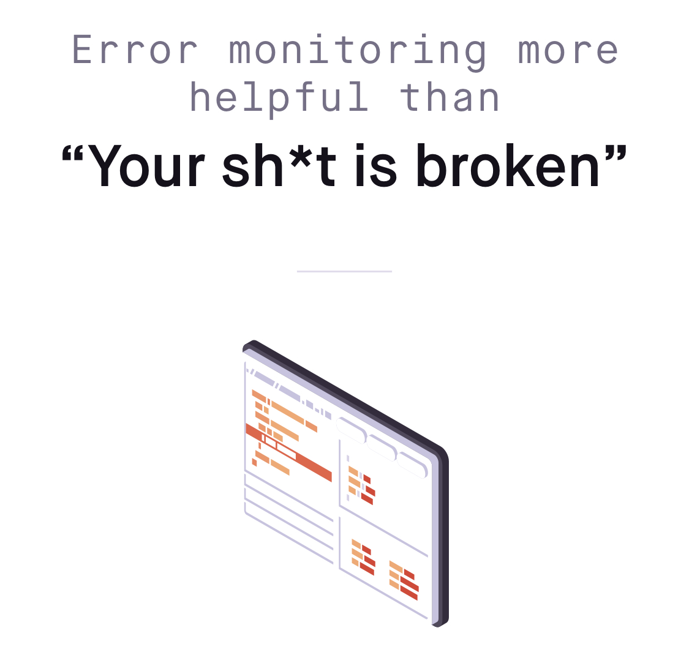
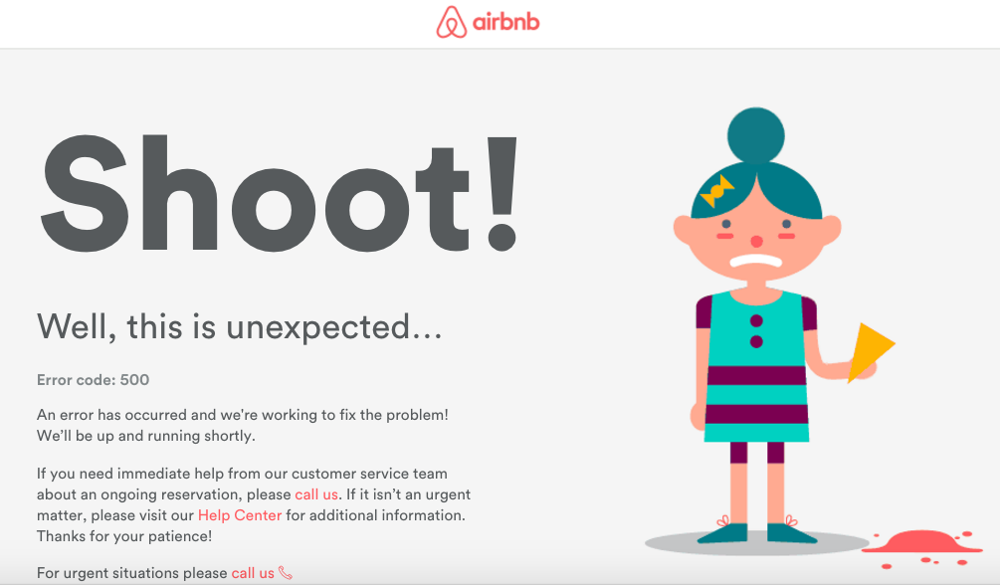

build-lists: true

# [fit] Sentry
## What is it, how do you use it, and why should you care?

---

# Sentry is an _exception tracker_


---



---

# Sentry helps us monitor _uncaught_ exceptions 

---

# you know, these...

---



---

- How many times has an exception occurred?
- How many users have experienced it?
- What was the user doing when they experienced it?

---

# How we deal with exceptions without an Exception Tracker

- Deploy some code
- User reports bug _(e.g.: "the page isn't loading")_
- Devs check the logs
- Discover an exception thrown on page load for 50% of users
- Frantically release hotfix
- _repeat_

---

# How we deal with exceptions with an Exception Tracker

- Deploy some code
- Get notified of new exception
- Fix it before users even need to report it

---

# Isn't Sentry just more logs?

---


---

> Logging provides you with a trail of events. Often those events are errors, but many times they're simply informational. Sentry is fundamentally different because we focus on exceptions, or in other words, we capture application crashes.

---

> Sentry works with your application logging infrastructure, often integrating directly. It does not replace the need for those logs, and it's also not a destination for things that aren't actionable errors or crashes.
--- 
# Logs inform us about _expected_ events

## Sentry informs us about _unexpected_ events

---


# Logs inform us about _expected_ events

```php
$user = User::findBy($id);
if ($user == null) {
	Logger::error("User not found!");
}
```

---

# Logs inform us about _expected_ events

```php
try {
	$user = User::findBy($id);
} catch (NotFoundException $e) {
	Logger::error("User not found!", ["exception" => $e]);
}
```

---

# Sentry informs us about **unexpected** events

```php
try {
	$user = User::findBy($id);
} catch (NotFoundException $e) {
	Logger::error("User not found!", ["exception" => $e]);
}
// throws ArgumentException: 
// expected $id to be of type integer, got string
```

---

# Uncaught exceptions are _really, really bad_.

- Users seeing 500 pages
- Cron jobs dying
- Background processes aborting early
- Data not loading

---

# Exceptions can always happen, and you need a way to deal with them

Unless you know what kind of exception you are expecting, logging it and moving on isn't enough.

---

# Integrating Sentry into an application

_demo_


---

# Install

```
# Pipfile/requirements.txt

[packages]
flask = "*"
flask_sqlalchemy = "*"
sentry-sdk = "*"
"sentry-sdk[flask]" = "*"
```

---

# Import the SDK


```python
# app.py

import sentry_sdk
sentry_sdk.init(
  "https://40c3c5d83e5a46199f063c0ac2b5d200@sentry.io/1390866"
)
```

---

# Catch exceptions in web requests


```python
@app.errorhandler(Exception)
def handle_exception(e):
    sentry_sdk.capture_exception(e)
    raise e
```

---

# Shortcut with the Flask SDK


```python
from sentry_sdk.integrations.flask import FlaskIntegration

sentry_sdk.init(
    dsn="https://40c3c5d83e5a46199f063c0ac2b5d200@sentry.io/1390866",
    integrations=[FlaskIntegration()],
)
```

---

# Adding user context

```python
@app.before_request
def setup_setry_context():
    with sentry_sdk.configure_scope() as scope:
        if 'user' in session:
            scope.user = {"id" : session['user']}
```
---

# Environment

```python
sentry_sdk.init(
    dsn="https://40c3c5d83e5a46199f063c0ac2b5d200@sentry.io/1390866",
    environment=app.config["ENV"],
    integrations=[FlaskIntegration()],
)
```
---

# Callbacks

```python
def before_sentry_send(event, hint):
    if app.config["ENV"] == "development":
        return None

    Metrics.increment("exceptions.count")
    return event
```
---

# Callbacks

```python
sentry_sdk.init(
    dsn="https://40c3c5d83e5a46199f063c0ac2b5d200@sentry.io/1390866",
    environment=app.config["ENV"],
    integrations=[FlaskIntegration()],
    before_send=before_sentry_send
)
```
---

# Ignore Exceptions

```python
import werkzeug.exceptions

sentry_sdk.init(
    dsn="https://40c3c5d83e5a46199f063c0ac2b5d200@sentry.io/1390866",
    environment=app.config["ENV"],
    integrations=[FlaskIntegration()],
    before_send=before_sentry_send
    ignore_errors=[werkzeug.exceptions.NotFound],
)
```

---

# Capturing Exceptions outside of HTTP requests

```python
# cron job that runs daily

for todo in todos:
    if todo.text == "Can't delete me!":
        raise Exception("Couldn't delete todo!")

    todo.delete()
```

---

# Capture and move on!

```python
for todo in todos:
  try:
      if todo.text == "Can't delete me!":
          raise Exception("Couldn't delete todo!")

      todo.delete()

  except Exception as e:
      # Capture the exception, but keep the job moving
      print("Encountered exception")
      capture_exception(e)
```

---

# Custom Tags

```python
# clear_todos.py

with sentry_sdk.configure_scope() as scope:
    scope.set_tag("cron-job-name", "clear_todos")

for todo in todos:
  ...
```

Searchable in Sentry as `cron-job-name:clear_todos`. Indexed!

---

# Custom Context


```python
with sentry_sdk.configure_scope() as scope:
    scope.set_tag("cron-job", "clear_todos")
    scope.set_extra("todo.id", todo.id)
    scope.set_extra("todo.text", todo.text)
```

---

# Notifications

Sentry has awesomely configurable notifications

---

# Notifications

Rulesets allow for intelligent configuration of notificiations that fits your workflow

---

# Example Notification Ruleset

- On first occurence of an error:
  - Send a Slack message to the team channel
  - Email the team

---

# Example Notification Rules

- After an exception occurs more than 100 times
  - Send a second email to the team

---

# Example Notification Rules

- If an exception affects 100 users
  - Page the on-call engineer

---

# Example Notification Rules

- On _regressions_
  - Email the team

---

# Sentry Workflow

Resolution, Regressions

---

# Resolution

A "resolved" exception is one that you never expect to see again

- Deployed code that can fix the exception
- Configurable auto-resolve

---

# Regressions

- If Sentry sees a new event under an issue you've resolved, it will mark it as a regression

---

# Regressions

- Regression checking allows you to check if your work actually did anything

---

# There's a lot more to learn!

I've really only scratched the surface

---

# There's a lot more to learn

- Links to help docs
- Link to the wiki
