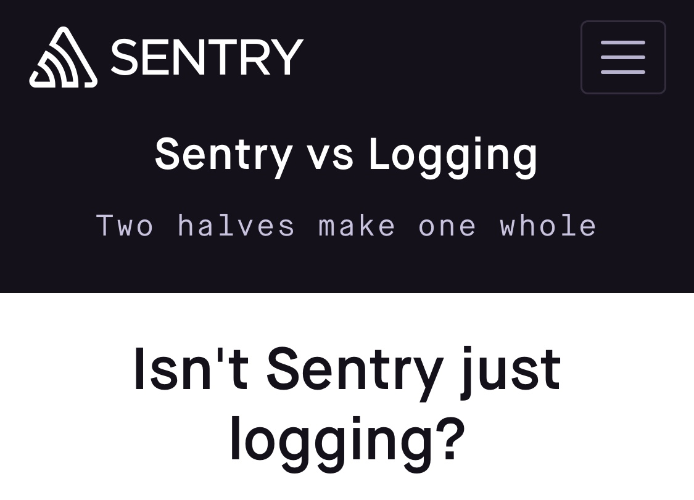

build-lists: true

# [fit] Sentry
## What is it, how do you use it, and why should you care?

---

# Sentry is an _exception tracker_

---


---

# Sentry helps us monitor _uncaught_ exceptions 

---


---

# Sentry helps us answer important questions about Exceptions:

- How many times has an exception occurred?
- How many users have experienced it?
- What was the user doing when they experienced it?

---

# How we deal with exceptions without an Exception Tracker

- Deploy some code
- User reports bug _(e.g.: "the page isn't loading")_
- Devs check the logs
- Discover a bug in the release is causing that page to crash
- Scramble to release fix
- _repeat_

---

# How we deal with exceptions with an Exception Tracker

- Deploy some code
- A user sees an exception
- Sentry notifies us of the exception
- Immediately rollback, or release a fix before any significant impact

---

# Isn't Sentry just more logs?

---



---


---

# Logs inform us about _expected_ events

---

## Sentry informs us about _unexpected_ events

---


# Logs inform us about _expected_ events

```php
$user = User::findBy($id);

if ($user == null) {
  Logger::error("User not found!");
}
```

---

# Logs inform us about _expected_ events

```php
try {
  $user = User::findBy($id);
} catch (NotFoundException $e) {
  Logger::error("User not found!", ["exception" => $e]);
}
```

---

# Sentry informs us about **unexpected** events

```php
try {
  $user = User::findBy($id);
  // throws ArgumentException: 
  // expected $id to be of type integer, got string

} catch (NotFoundException $e) {
  Logger::error("User not found!", ["exception" => $e]);
}
```

Where are our logs now??

---

# Uncaught exceptions are _really, really bad_.

- Users seeing 500 pages
- Data not loading
- Background processes aborting before finishing

---

# Logging it and moving on is rarely enough

---

# Sentry Main Concepts

---

# Issues

*Issue*: A _class_ of exceptions, specific to a single location in the code.

---


# Events

*Event*: A single instance of an issue. Sentry will intelligently group events into issues.

---

# Context

*Context*: Extra data associated with an event (request parameters, browser, logged in user).

---

# Projects

*Project*: Sentry's idea of an application.  Hosted vs DeepData, Mobile Apps, etc.


---

# Integrating Sentry into an application

_demo_

---

# Install

```
# Pipfile/requirements.txt

[packages]
flask = "*"
flask_sqlalchemy = "*"
sentry-sdk = "*"
"sentry-sdk[flask]" = "*"
```

---

# Import the SDK


```python
# app.py

import sentry_sdk
sentry_sdk.init(
  "https://40c3c5d83e5a46199f063c0ac2b5d200@sentry.io/1390866"
)
```

---

# Catch exceptions in web requests


```python
@app.errorhandler(Exception)
def handle_exception(e):
    sentry_sdk.capture_exception(e)
    raise e
```

---

# Shortcut with the Flask SDK


```python
from sentry_sdk.integrations.flask import FlaskIntegration

sentry_sdk.init(
    dsn="https://40c3c5d83e5a46199f063c0ac2b5d200@sentry.io/1390866",
    integrations=[FlaskIntegration()],
)
```

---

# Adding user context

```python
@app.before_request
def setup_setry_context():
    with sentry_sdk.configure_scope() as scope:
        if 'user' in session:
            scope.user = {"id" : session['user']}
```
---

# Environment

```python
sentry_sdk.init(
    dsn="https://40c3c5d83e5a46199f063c0ac2b5d200@sentry.io/1390866",
    environment=app.config["ENV"],
    integrations=[FlaskIntegration()],
)
```
---

# Callbacks

```python
def before_sentry_send(event, hint):
    if app.config["ENV"] == "development":
        return None

    Metrics.increment("exceptions.count")
    return event
```
---

# Callbacks

```python
sentry_sdk.init(
    dsn="https://40c3c5d83e5a46199f063c0ac2b5d200@sentry.io/1390866",
    environment=app.config["ENV"],
    integrations=[FlaskIntegration()],
    before_send=before_sentry_send
)
```
---

# Ignore Exceptions

```python
import werkzeug.exceptions

sentry_sdk.init(
    dsn="https://40c3c5d83e5a46199f063c0ac2b5d200@sentry.io/1390866",
    environment=app.config["ENV"],
    integrations=[FlaskIntegration()],
    before_send=before_sentry_send
    ignore_errors=[werkzeug.exceptions.NotFound],
)
```

---

# Capturing Exceptions outside of HTTP requests

```python
# cron job that runs daily

for todo in todos:
    try:
      if todo.text == "Can't delete me!":
          raise Exception("Couldn't delete todo!")

      todo.delete()
    except Exception as e:
      Logger.info("Encountered error!")
```

---

# Capture those errors!

```python
for todo in todos:
  try:
      if todo.text == "Can't delete me!":
          raise Exception("Couldn't delete todo!")

      todo.delete()

  except Exception as e:
      # Capture the exception, but keep the job moving
      print("Encountered exception")
      capture_exception(e)
```

---

# Custom Tags

```python
# clear_todos.py

with sentry_sdk.configure_scope() as scope:
    scope.set_tag("cron-job-name", "clear_todos")

for todo in todos:
  ...
```

Searchable in Sentry as `cron-job-name:clear_todos`. Indexed!

---

# Custom Context


```python
with sentry_sdk.configure_scope() as scope:
    scope.set_tag("cron-job", "clear_todos")
    scope.set_extra("todo.id", todo.id)
    scope.set_extra("todo.text", todo.text)
```

---

# [fit] Sentry and *you*

## How can you incorporate Sentry into your team's workflow?

---

# Step 1: Create a project for you application

### maybe ask an admin for help

---

# Step 2: Add the SDK to your application

- Make sure it's capturing exceptions _everywhere_, not just in web requests.
- Disable it in development.
- Test it staging and production.

---

# Step 3: Ignore Unactionable Exceptions

- Otherwise they'll eat into our rate limit
- Use a before\_send hook or `ignored_exceptions` configuration option

---

# Step 4: Add user context

- Make `user.id` the Hosted account, if it's available
- Then add whatever else you want!

---

# Step 5: Add more context!

- Tags for cron jobs
- Arguments for background jobs

---

# Audit your app for `catch Exception` statements

These (likely important!) exceptions are not making it to Sentry!

- Manually send to Sentry after the catch
- Or make the catch more specific.

---

# Set up notification rules

_example ruleset:_

- New issues go to Slack.
- 100 events for an issue in a day sends an email
- 1000 events/100 users in an hour Pages someone.
- Regression notifications.

---

# Monitor it!

Make monitoring for new exceptions part of being the interruptible developer

---

# The Sentry SDK should be installed in your app _before its first production deploy_

---

# Dealing with a backlog

- Prioritize by impact to users
- Filter out what's not actionable
- Address new items immediately

---

# There's a lot more to learn!

- Breadcrumbs
- GitHub integration
- Client-side integrations! (team mobile, where you at)

---

# There's a lot more to learn!

Sentry best practices on Confluence:
  - 
Download these slides:
  - 
Sentry Documentation:
  - https://docs.sentry.io/
